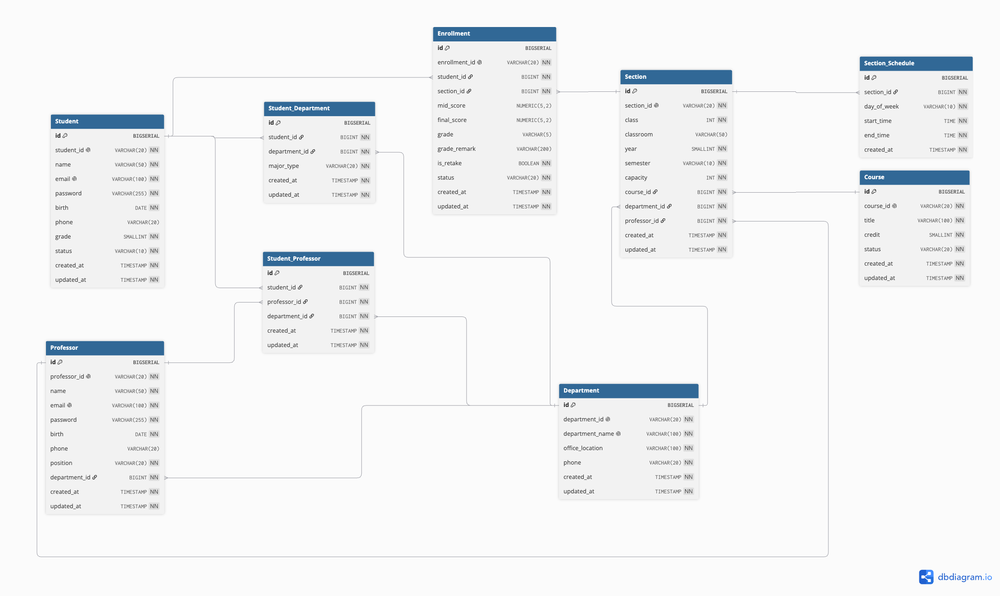
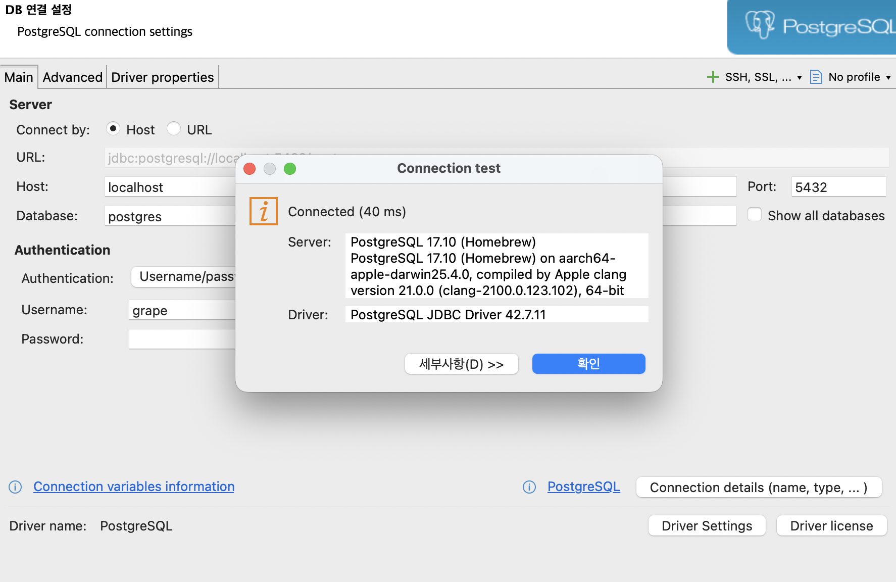
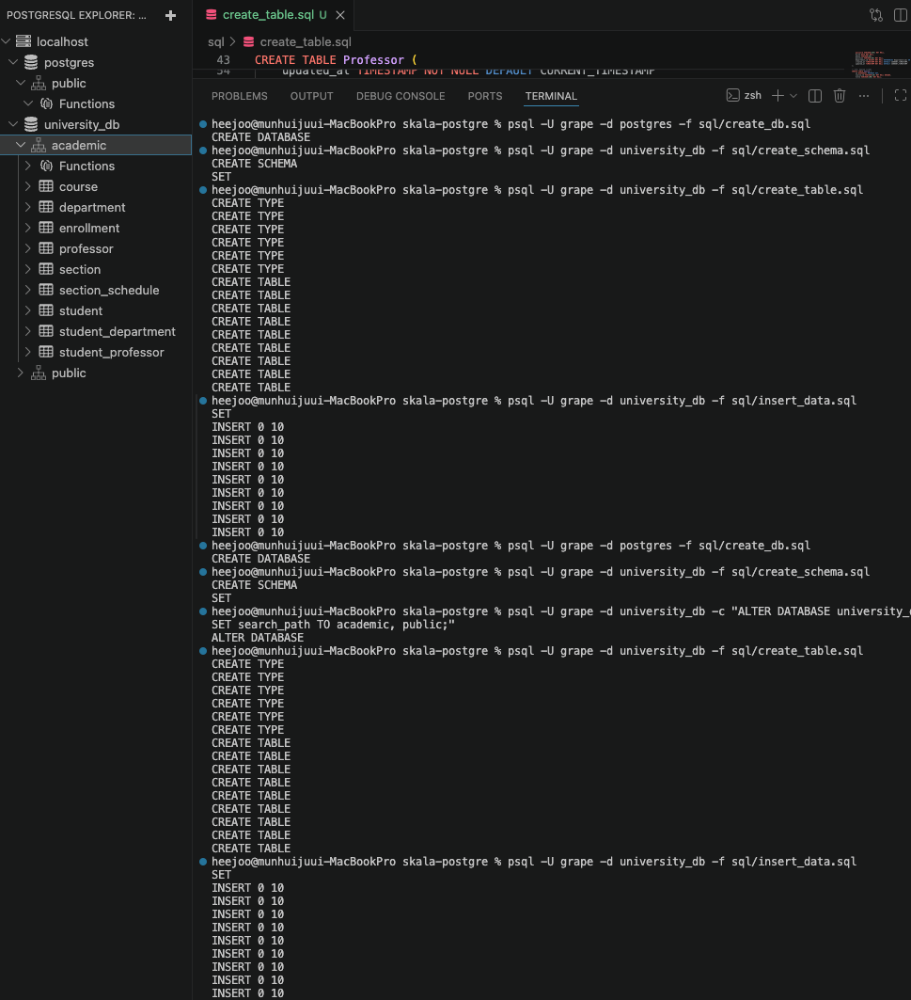
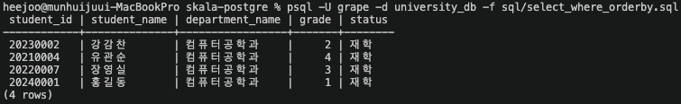
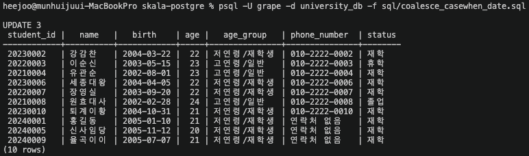
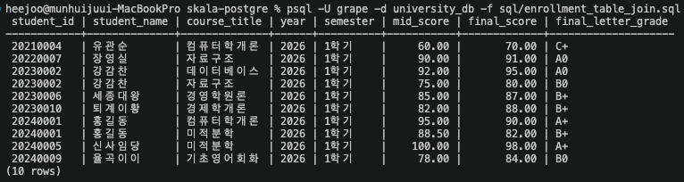

# 🎓 학사관리시스템 (Academic Management System)

PostgreSQL 기반의 대학 학사관리 시스템 데이터베이스 설계 및 구축 명세서입니다.

---

## 📌 0. 목차
1. [시스템 요구사항 및 설계 방향](#1-시스템-요구사항-및-설계-방향)
2. [데이터베이스 ERD 및 접속 화면](#2-데이터베이스-erd-및-접속-화면)
3. [DB 및 스키마 생성 SQL](#3-db-및-스키마-생성-sql)
4. [테이블 생성 DDL SQL](#4-테이블-생성-ddl-sql)
5. [샘플 데이터 INSERT SQL](#5-샘플-데이터-insert-sql)
6. [주요 기능별 SELECT 실습 SQL](#6-주요-기능별-select-실습-sql)

---

## 📋 1. 시스템 요구사항 및 설계 방향

### 0️⃣ PostgreSQL ENUM 타입 정의
데이터 무결성 확보 및 잘못된 코드 값 입력을 방지하기 위해 아래 항목들은 PostgreSQL ENUM 타입으로 관리합니다.
* `student_status_enum` : `'재학'`, `'휴학'`, `'제적'`, `'졸업'`
* `course_status_enum` : `'ACTIVE'`, `'INACTIVE'`
* `semester_enum` : `'1학기'`, `'2학기'`, `'여름학기'`, `'겨울학기'`
* `enrollment_status_enum` : `'APPLIED'`, `'COMPLETED'`, `'CANCELED'`
* `major_type_enum` : `'주전공'`, `'복수전공'`, `'부전공'`
* `day_of_week_enum` : `'월요일'`, `'화요일'`, `'수요일'`, `'목요일'`, `'금요일'`, `'토요일'`, `'일요일'`

### 👤 1. 회원 및 사용자 관리
* **학생 (Student)**: 학번, 이름, 이메일, 비밀번호, 생년월일, 연락처 관리 (학년 `1~4` 제한, 상태 기본값 `'재학'`, 유일성 보장)
* **교수 (Professor)**: 교번, 이름, 이메일, 비밀번호, 생년월일, 연락처, 직급 관리 (학과 소속 필수, 소속 교수 존재 시 학과 삭제 방지 `ON DELETE RESTRICT`)

### 🏫 2. 조직 및 교과목 관리
* **학과 (Department)**: 학과 코드, 학과명, 사무실 위치, 전화번호 관리 (유일성 보장)
* **과목 (Course)**: 과목 코드, 과목명, 이수 학점, 과목 상태 관리 (표준 교과목 마스터 정보)

### 📅 3. 강좌 및 시간표 관리
* **개설강좌 (Section)**: 연도, 학기, 분반, 강의실, 정원 설정 및 동일 `[과목 + 연도 + 학기 + 분반]` 중복 개설 방지 제약
* **강좌 시간표 (Section_Schedule)**: 요일/시간대 관리 (1:N 관계, 강좌 삭제 시 연쇄 삭제 `ON DELETE CASCADE`)

### 📝 4. 수강 및 성적 관리
* **수강신청 (Enrollment)**: 학생별 개설강좌 신청 상태 및 재수강 여부 관리 (동일 학생·강좌 중복 신청 방지)
* **성적 처리**: 중간/기말고사 점수 및 최종 학점, 사유 기록

### 🔗 5. 학생 전공 및 지도교수 매핑
* **학생 전공 (Student_Department)**: 주/복수/부전공 관리 (동일 학과 중복 등록 및 동일 전공 유형 중복 제한)
* **지도교수 배정 (Student_Professor)**: 학과별 지도교수 1명 배정 제한

### ⚙️ 6. 시스템 공통 규칙
* **데이터 이력 관리**: `created_at`, `updated_at` 자동 기록
* **무결성 및 연쇄 정책**: 학생 삭제 시 관련 내역 연쇄 삭제(`CASCADE`), 마스터 데이터 무단 삭제 방지(`RESTRICT`)

---

## 🖼️ 2. 데이터베이스 ERD 및 접속 화면

### ERD (Entity-Relationship Diagram)


### PostgreSQL 접속 확인


---

## 🛠️ 3. DB 및 스키마 생성 (SQL)

### `create_db.sql`
```sql
CREATE DATABASE university_db
    WITH ENCODING = 'UTF8'
    LC_COLLATE = 'en_US.UTF-8'
    LC_CTYPE = 'en_US.UTF-8'
    TEMPLATE = template0;
```

### `create_schema.sql`
```sql
CREATE SCHEMA IF NOT EXISTS academic;

-- 스키마 기본 탐색 경로 설정 (academic 스키마 우선 참조)
SET search_path TO academic, public;
```
---

## 🏗️ 4. 테이블 생성 DDL (SQL)

### `create_table.sql`
```sql
-- 1. ENUM 타입 생성
CREATE TYPE student_status_enum AS ENUM ('재학', '휴학', '제적', '졸업');
CREATE TYPE course_status_enum AS ENUM ('ACTIVE', 'INACTIVE');
CREATE TYPE semester_enum AS ENUM ('1학기', '2학기', '여름학기', '겨울학기');
CREATE TYPE enrollment_status_enum AS ENUM ('APPLIED', 'COMPLETED', 'CANCELED');
CREATE TYPE major_type_enum AS ENUM ('주전공', '복수전공', '부전공');
CREATE TYPE day_of_week_enum AS ENUM ('월요일', '화요일', '수요일', '목요일', '금요일', '토요일', '일요일');

-- 2. TABLE 생성
-- 2-1. Student (학생)
CREATE TABLE Student (
    id BIGSERIAL PRIMARY KEY,
    student_id VARCHAR(20) NOT NULL UNIQUE,
    name VARCHAR(50) NOT NULL,
    email VARCHAR(100) NOT NULL UNIQUE,
    password VARCHAR(255) NOT NULL,
    birth DATE NOT NULL,
    phone VARCHAR(20),
    grade SMALLINT NOT NULL CHECK (grade BETWEEN 1 AND 4),
    status student_status_enum NOT NULL DEFAULT '재학',
    created_at TIMESTAMP NOT NULL DEFAULT CURRENT_TIMESTAMP,
    updated_at TIMESTAMP NOT NULL DEFAULT CURRENT_TIMESTAMP
);

-- 2-2. Department (학과)
CREATE TABLE Department (
    id BIGSERIAL PRIMARY KEY,
    department_id VARCHAR(20) NOT NULL UNIQUE,
    department_name VARCHAR(100) NOT NULL UNIQUE,
    office_location VARCHAR(100) NOT NULL,
    phone VARCHAR(20) NOT NULL,
    created_at TIMESTAMP NOT NULL DEFAULT CURRENT_TIMESTAMP,
    updated_at TIMESTAMP NOT NULL DEFAULT CURRENT_TIMESTAMP
);

-- 2-3. Professor (교수)
CREATE TABLE Professor (
    id BIGSERIAL PRIMARY KEY,
    professor_id VARCHAR(20) NOT NULL UNIQUE,
    name VARCHAR(50) NOT NULL,
    email VARCHAR(100) NOT NULL UNIQUE,
    password VARCHAR(255) NOT NULL,
    birth DATE NOT NULL,
    phone VARCHAR(20),
    position VARCHAR(20) NOT NULL,
    department_id BIGINT NOT NULL REFERENCES Department(id) ON DELETE RESTRICT ON UPDATE CASCADE,
    created_at TIMESTAMP NOT NULL DEFAULT CURRENT_TIMESTAMP,
    updated_at TIMESTAMP NOT NULL DEFAULT CURRENT_TIMESTAMP
);

-- 2-4. Course (과목)
CREATE TABLE Course (
    id BIGSERIAL PRIMARY KEY,
    course_id VARCHAR(20) NOT NULL UNIQUE,
    title VARCHAR(100) NOT NULL,
    credit SMALLINT NOT NULL,
    status course_status_enum NOT NULL DEFAULT 'ACTIVE',
    created_at TIMESTAMP NOT NULL DEFAULT CURRENT_TIMESTAMP,
    updated_at TIMESTAMP NOT NULL DEFAULT CURRENT_TIMESTAMP
);

-- 2-5. Section (개설강좌)
CREATE TABLE Section (
    id BIGSERIAL PRIMARY KEY,
    section_id VARCHAR(50) NOT NULL UNIQUE,
    class INT NOT NULL,
    classroom VARCHAR(50),
    year SMALLINT NOT NULL,
    semester semester_enum NOT NULL,
    capacity INT NOT NULL DEFAULT 30,
    course_id BIGINT NOT NULL REFERENCES Course(id) ON DELETE RESTRICT ON UPDATE CASCADE,
    department_id BIGINT NOT NULL REFERENCES Department(id) ON DELETE RESTRICT ON UPDATE CASCADE,
    professor_id BIGINT NOT NULL REFERENCES Professor(id) ON DELETE RESTRICT ON UPDATE CASCADE,
    created_at TIMESTAMP NOT NULL DEFAULT CURRENT_TIMESTAMP,
    updated_at TIMESTAMP NOT NULL DEFAULT CURRENT_TIMESTAMP,
    CONSTRAINT uk_course_year_semester_class UNIQUE (course_id, year, semester, class)
);

-- 2-6. Section_Schedule (강좌 시간표)
CREATE TABLE Section_Schedule (
    id BIGSERIAL PRIMARY KEY,
    section_id BIGINT NOT NULL REFERENCES Section(id) ON DELETE CASCADE ON UPDATE CASCADE,
    day_of_week day_of_week_enum NOT NULL,
    start_time TIME NOT NULL,
    end_time TIME NOT NULL,
    created_at TIMESTAMP NOT NULL DEFAULT CURRENT_TIMESTAMP
);

-- 2-7. Enrollment (수강신청)
CREATE TABLE Enrollment (
    id BIGSERIAL PRIMARY KEY,
    enrollment_id VARCHAR(20) NOT NULL UNIQUE,
    student_id BIGINT NOT NULL REFERENCES Student(id) ON DELETE CASCADE ON UPDATE CASCADE,
    section_id BIGINT NOT NULL REFERENCES Section(id) ON DELETE CASCADE ON UPDATE CASCADE,
    mid_score NUMERIC(5,2),
    final_score NUMERIC(5,2),
    grade VARCHAR(5),
    grade_remark VARCHAR(200),
    is_retake BOOLEAN NOT NULL DEFAULT FALSE,
    status enrollment_status_enum NOT NULL DEFAULT 'APPLIED',
    created_at TIMESTAMP NOT NULL DEFAULT CURRENT_TIMESTAMP,
    updated_at TIMESTAMP NOT NULL DEFAULT CURRENT_TIMESTAMP,
    CONSTRAINT uk_student_section UNIQUE (student_id, section_id)
);

-- 2-8. Student_Department (학생 전공)
CREATE TABLE Student_Department (
    id BIGSERIAL PRIMARY KEY,
    student_id BIGINT NOT NULL REFERENCES Student(id) ON DELETE CASCADE ON UPDATE CASCADE,
    department_id BIGINT NOT NULL REFERENCES Department(id) ON DELETE RESTRICT ON UPDATE CASCADE,
    major_type major_type_enum NOT NULL,
    created_at TIMESTAMP NOT NULL DEFAULT CURRENT_TIMESTAMP,
    updated_at TIMESTAMP NOT NULL DEFAULT CURRENT_TIMESTAMP,
    CONSTRAINT uk_student_department UNIQUE (student_id, department_id),
    CONSTRAINT uk_student_majortype UNIQUE (student_id, major_type)
);

-- 2-9. Student_Professor (지도교수 배정)
CREATE TABLE Student_Professor (
    id BIGSERIAL PRIMARY KEY,
    student_id BIGINT NOT NULL REFERENCES Student(id) ON DELETE CASCADE ON UPDATE CASCADE,
    professor_id BIGINT NOT NULL REFERENCES Professor(id) ON DELETE RESTRICT ON UPDATE CASCADE,
    department_id BIGINT NOT NULL REFERENCES Department(id) ON DELETE RESTRICT ON UPDATE CASCADE,
    created_at TIMESTAMP NOT NULL DEFAULT CURRENT_TIMESTAMP,
    updated_at TIMESTAMP NOT NULL DEFAULT CURRENT_TIMESTAMP,
    CONSTRAINT uk_student_dept_advisor UNIQUE (student_id, department_id)
);
```

---

## 📥 5. Sample Data INSERT (SQL)

### `insert_data.sql`
```sql
SET search_path TO academic, public;

-- 1. Department (10건)
INSERT INTO Department (department_id, department_name, office_location, phone) VALUES
('DEPT_CS', '컴퓨터공학과', 'IT관 301호', '02-1234-0001'),
('DEPT_EE', '전자공학과', '공학관 201호', '02-1234-0002'),
('DEPT_ME', '기계공학과', '공학관 101호', '02-1234-0003'),
('DEPT_MATH', '수학과', '수학관 401호', '02-1234-0004'),
('DEPT_PHYS', '물리학과', '이학관 102호', '02-1234-0005'),
('DEPT_BIZ', '경영학과', '경영관 501호', '02-1234-0006'),
('DEPT_ECON', '경제학과', '경영관 402호', '02-1234-0007'),
('DEPT_KOR', '국어국문학과', '인문관 201호', '02-1234-0008'),
('DEPT_ENG', '영어영문학과', '인문관 302호', '02-1234-0009'),
('DEPT_DESIGN', '시각디자인학과', '조형관 101호', '02-1234-0010');

-- 2. Course (10건)
INSERT INTO Course (course_id, title, credit, status) VALUES
('CS101', '컴퓨터학개론', 3, 'ACTIVE'),
('CS201', '자료구조', 3, 'ACTIVE'),
('CS301', '데이터베이스', 3, 'ACTIVE'),
('EE101', '회로이론', 3, 'ACTIVE'),
('ME101', '열역학', 3, 'ACTIVE'),
('MATH101', '미적분학', 3, 'ACTIVE'),
('PHYS101', '일반물리학', 3, 'ACTIVE'),
('BIZ101', '경영학원론', 3, 'ACTIVE'),
('ECON101', '경제학개론', 3, 'ACTIVE'),
('ENG101', '기초영어회화', 2, 'ACTIVE');

-- 3. Professor (10건)
INSERT INTO Professor (professor_id, name, email, password, birth, phone, position, department_id) VALUES
('PROF_101', '김철수', 'prof_kim@univ.ac.kr', 'pass1234', '1975-03-12', '010-1111-0001', '정교수', 1),
('PROF_102', '이영희', 'prof_lee@univ.ac.kr', 'pass1234', '1980-07-24', '010-1111-0002', '부교수', 1),
('PROF_201', '박민수', 'prof_park@univ.ac.kr', 'pass1234', '1968-11-05', '010-1111-0003', '정교수', 2),
('PROF_301', '정우성', 'prof_jung@univ.ac.kr', 'pass1234', '1982-01-15', '010-1111-0004', '조교수', 3),
('PROF_401', '최지우', 'prof_choi@univ.ac.kr', 'pass1234', '1979-09-30', '010-1111-0005', '부교수', 4),
('PROF_501', '강동원', 'prof_kang@univ.ac.kr', 'pass1234', '1985-04-18', '010-1111-0006', '조교수', 5),
('PROF_601', '한효주', 'prof_han@univ.ac.kr', 'pass1234', '1973-12-25', '010-1111-0007', '정교수', 6),
('PROF_701', '송중기', 'prof_song@univ.ac.kr', 'pass1234', '1981-06-08', '010-1111-0008', '부교수', 7),
('PROF_801', '김태리', 'prof_kimtr@univ.ac.kr', 'pass1234', '1988-02-14', '010-1111-0009', '조교수', 8),
('PROF_901', '공유', 'prof_gong@univ.ac.kr', 'pass1234', '1977-10-10', '010-1111-0010', '정교수', 9);

-- 4. Student (10건)
INSERT INTO Student (student_id, name, email, password, birth, phone, grade, status) VALUES
('20240001', '홍길동', 'hong@student.ac.kr', 'pwd1234', '2005-01-10', '010-2222-0001', 1, '재학'),
('20230002', '강감찬', 'kang@student.ac.kr', 'pwd1234', '2004-03-22', '010-2222-0002', 2, '재학'),
('20220003', '이순신', 'lee@student.ac.kr', 'pwd1234', '2003-05-15', '010-2222-0003', 3, '휴학'),
('20210004', '유관순', 'yoo@student.ac.kr', 'pwd1234', '2002-08-01', '010-2222-0004', 4, '재학'),
('20240005', '신사임당', 'shin@student.ac.kr', 'pwd1234', '2005-11-12', '010-2222-0005', 1, '재학'),
('20230006', '세종대왕', 'sejong@student.ac.kr', 'pwd1234', '2004-04-05', '010-2222-0006', 2, '재학'),
('20220007', '장영실', 'jang@student.ac.kr', 'pwd1234', '2003-09-20', '010-2222-0007', 3, '재학'),
('20210008', '원효대사', 'wonhyo@student.ac.kr', 'pwd1234', '2002-02-28', '010-2222-0008', 4, '졸업'),
('20240009', '율곡이이', 'yi@student.ac.kr', 'pwd1234', '2005-07-07', '010-2222-0009', 1, '재학'),
('20230010', '퇴계이황', 'hwang@student.ac.kr', 'pwd1234', '2004-10-31', '010-2222-0010', 2, '재학');

-- 5. Section (10건)
INSERT INTO Section (section_id, class, classroom, year, semester, capacity, course_id, department_id, professor_id) VALUES
('SEC_2026_1_CS101_01', 1, 'IT관 101호', 2026, '1학기', 40, 1, 1, 1),
('SEC_2026_1_CS201_01', 1, 'IT관 102호', 2026, '1학기', 35, 2, 1, 1),
('SEC_2026_1_CS301_01', 1, 'IT관 201호', 2026, '1학기', 30, 3, 1, 2),
('SEC_2026_1_EE101_01', 1, '공학관 301호', 2026, '1학기', 40, 4, 2, 3),
('SEC_2026_1_ME101_01', 1, '공학관 105호', 2026, '1학기', 30, 5, 3, 4),
('SEC_2026_1_MATH101_01', 1, '수학관 201호', 2026, '1학기', 50, 6, 4, 5),
('SEC_2026_1_PHYS101_01', 1, '이학관 101호', 2026, '1학기', 45, 7, 5, 6),
('SEC_2026_1_BIZ101_01', 1, '경영관 101호', 2026, '1학기', 60, 8, 6, 7),
('SEC_2026_1_ECON101_01', 1, '경영관 202호', 2026, '1학기', 50, 9, 7, 8),
('SEC_2026_1_ENG101_01', 1, '인문관 101호', 2026, '1학기', 25, 10, 9, 10);

-- 6. Section_Schedule (10건)
INSERT INTO Section_Schedule (section_id, day_of_week, start_time, end_time) VALUES
(1, '월요일', '09:00:00', '10:30:00'),
(1, '수요일', '09:00:00', '10:30:00'),
(2, '화요일', '10:30:00', '12:00:00'),
(2, '목요일', '10:30:00', '12:00:00'),
(3, '월요일', '13:00:00', '14:30:00'),
(3, '수요일', '13:00:00', '14:30:00'),
(4, '금요일', '09:00:00', '12:00:00'),
(5, '화요일', '14:00:00', '15:30:00'),
(6, '수요일', '15:00:00', '18:00:00'),
(7, '목요일', '13:00:00', '16:00:00');

-- 7. Enrollment (10건)
INSERT INTO Enrollment (enrollment_id, student_id, section_id, mid_score, final_score, grade, is_retake, status) VALUES
('ENR_2026_001', 1, 1, 95.00, 90.00, 'A+', FALSE, 'APPLIED'),
('ENR_2026_002', 1, 6, 88.50, 82.00, 'B+', FALSE, 'APPLIED'),
('ENR_2026_003', 2, 2, 75.00, 80.00, 'B0', FALSE, 'APPLIED'),
('ENR_2026_004', 2, 3, 92.00, 95.00, 'A0', FALSE, 'APPLIED'),
('ENR_2026_005', 4, 1, 60.00, 70.00, 'C+', TRUE,  'APPLIED'),
('ENR_2026_006', 5, 6, 100.00, 98.00, 'A+', FALSE, 'APPLIED'),
('ENR_2026_007', 6, 8, 85.00, 87.00, 'B+', FALSE, 'APPLIED'),
('ENR_2026_008', 7, 2, 90.00, 91.00, 'A0', FALSE, 'APPLIED'),
('ENR_2026_009', 9, 10, 78.00, 84.00, 'B0', FALSE, 'APPLIED'),
('ENR_2026_010', 10, 9, 82.00, 88.00, 'B+', FALSE, 'APPLIED');

-- 8. Student_Department (10건)
INSERT INTO Student_Department (student_id, department_id, major_type) VALUES
(1, 1, '주전공'),
(2, 1, '주전공'),
(2, 6, '복수전공'),
(3, 2, '주전공'),
(4, 1, '주전공'),
(5, 4, '주전공'),
(6, 6, '주전공'),
(7, 1, '주전공'),
(8, 3, '주전공'),
(9, 9, '주전공');

-- 9. Student_Professor (10건)
INSERT INTO Student_Professor (student_id, professor_id, department_id) VALUES
(1, 1, 1),
(2, 1, 1),
(3, 3, 2),
(4, 2, 1),
(5, 5, 4),
(6, 7, 6),
(7, 2, 1),
(8, 4, 3),
(9, 10, 9),
(10, 8, 7);
```

## [전체 DB, 스키마, Table 생성 및 Insert 실행 결과]


---

## 🔍 6. 주요 기능별 SELECT 실습 (SQL)

### 1️⃣ SELECT + WHERE + ORDER BY 기초 조회
컴퓨터공학과 소속 학생들을 이름 오름차순으로 조회합니다.
`select_where_orderby.sql`
```sql
SELECT 
    s.student_id, 
    s.name AS student_name, 
    d.department_name, 
    s.grade,
    s.status
FROM academic.student s
JOIN academic.student_department sd ON s.id = sd.student_id
JOIN academic.department d ON sd.department_id = d.id
WHERE d.department_name = '컴퓨터공학과'
ORDER BY s.name ASC;
```



### 2️⃣ COALESCE / CASE WHEN / 날짜 함수 활용
학생의 출생년도(birth) 기반 연령 계산 및 조건문(CASE WHEN), 연락처 NULL 치환(COALESCE)을 활용한 조회입니다.
`colaesce_casewhen_date.sql`
```sql
-- COALESCE 결과 확인을 위해 1학년 학생의 phone을 일시적으로 NULL 처리
UPDATE student SET phone = NULL WHERE grade = 1;

SELECT 
    student_id,
    name,
    birth,
    EXTRACT(YEAR FROM AGE(CURRENT_DATE, birth)) AS age,
    CASE 
        WHEN EXTRACT(YEAR FROM AGE(CURRENT_DATE, birth)) <= 22 THEN '저연령/재학생'
        ELSE '고연령/일반'
    END AS age_group,
    COALESCE(phone, '연락처 없음') AS phone_number,
    status
FROM academic.student;
```



### 3️⃣ 수강신청 교차 테이블 JOIN 조회
학생, 개설강좌, 과목 테이블을 결합하여 학생별 수강 내역 및 성적을 조회합니다.
`enrollment_table_join.sql`
```sql
SELECT 
    s.student_id,
    s.name AS student_name,
    c.title AS course_title,
    sec.year,
    sec.semester,
    e.mid_score,
    e.final_score,
    e.grade AS final_letter_grade
FROM enrollment e
JOIN student s ON e.student_id = s.id
JOIN section sec ON e.section_id = sec.id
JOIN course c ON sec.course_id = c.id
ORDER BY s.student_id ASC, sec.year DESC;
```


