# Practice 2 실행 보고서

## 1번

[SQL]

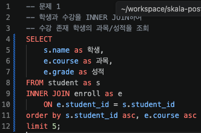

[실행결과]

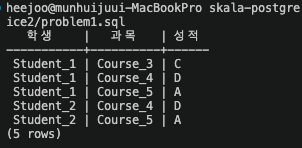

## 2번

[SQL]

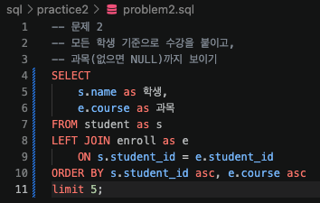

[실행결과]

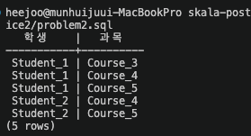

## 3번

[SQL]

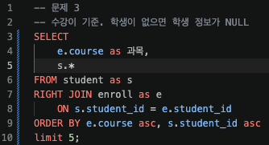

[실행결과]

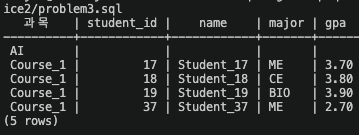

## 4번

[SQL]

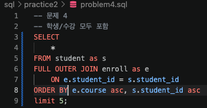

[실행결과]

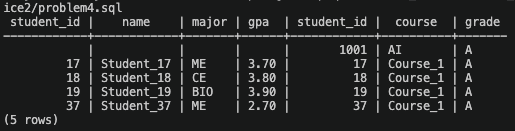

## 5번

[SQL]

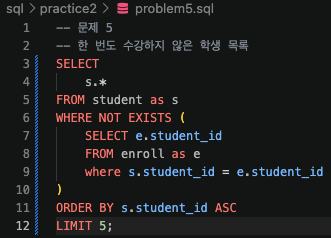

[실행결과]

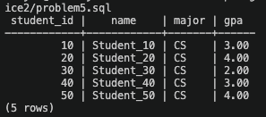

## 6번

[SQL]

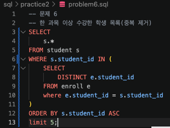

[실행결과]

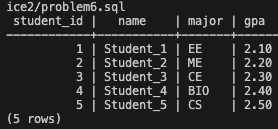

## 7번

[SQL]

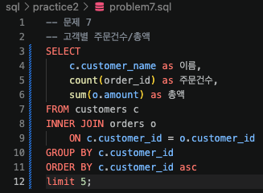

[실행결과]

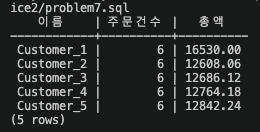

## 8번

[SQL]

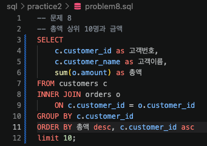

[실행결과]

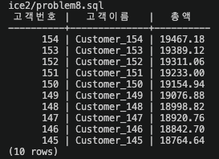

## 9번

[SQL]

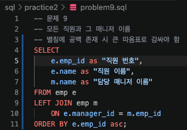

[실행결과]

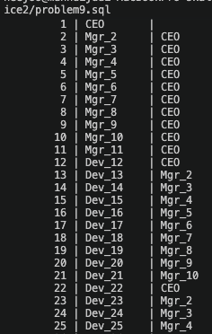

## 10번

[SQL]

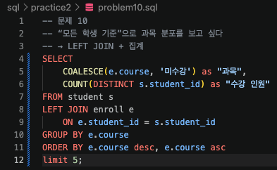

[실행결과]

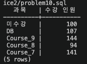

## 11번

[SQL]

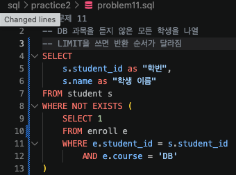

[실행결과]
LIMIT 여부에 따라 순서가 달라짐
PostgreSQL은 LIMIT N이 붙어 있으면 "전부 다 찾을 필요 없이 상위 N개만 빠르게 찾으면 끝내자"는 방향으로 실행 계획을 전면적으로 바꾸기 때문에 발생하는 현상
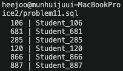

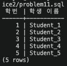

## 12번

[SQL]

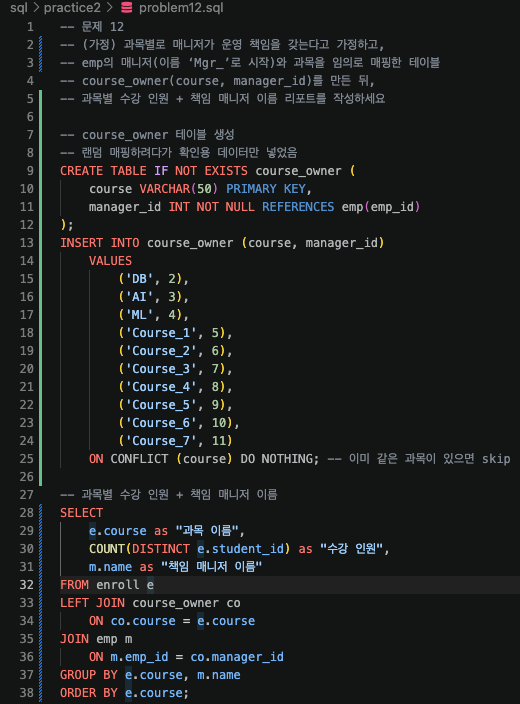

[실행결과]

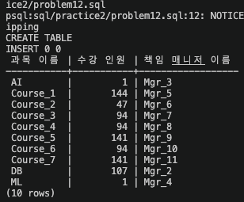

## 13번

[SQL]

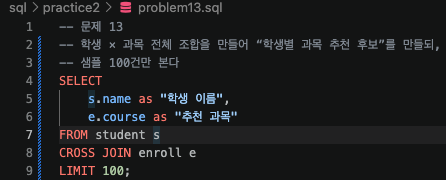

[실행결과]

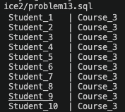

## 14번

[SQL]

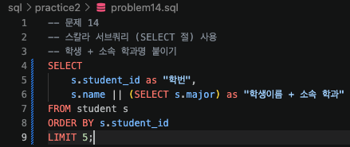

[실행결과]

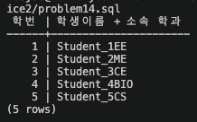

## 15번

[SQL]

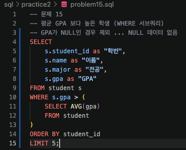

[실행결과]

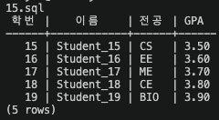

## 16번

[SQL]

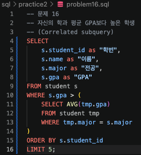

[실행결과]

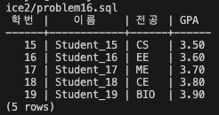

## 17번

[SQL]

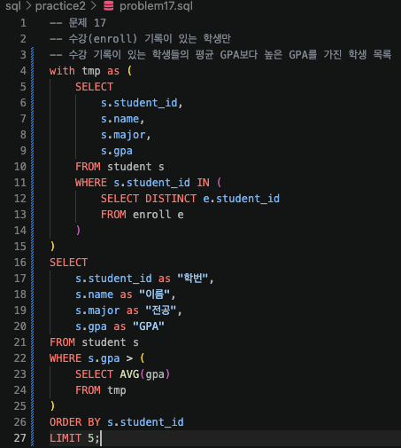

[실행결과]

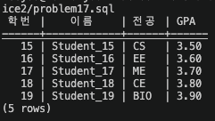

## 18번

[SQL]

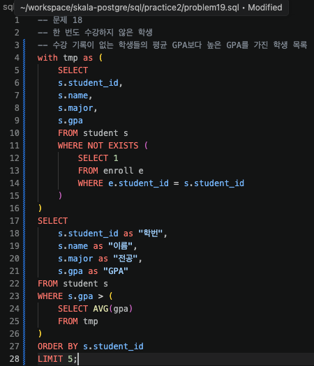

[실행결과]

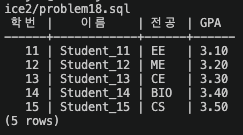

## 19번

[SQL]

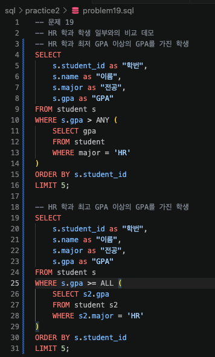

[실행결과]

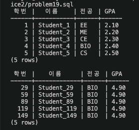

## 20번

[SQL]

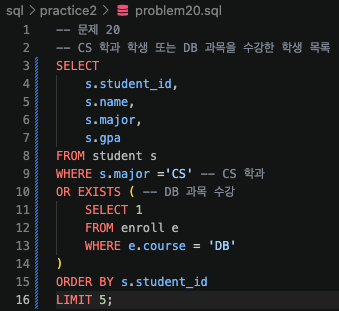

[실행결과]

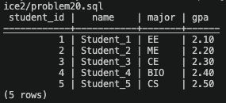

## 21번

[SQL]

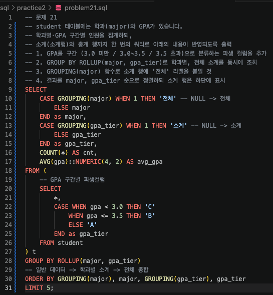

[실행결과]

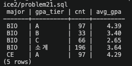

## 22번

[SQL]

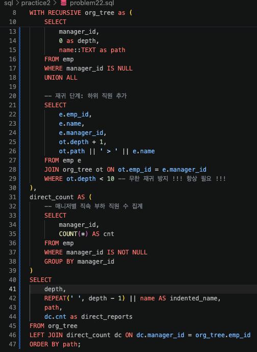

[실행결과]

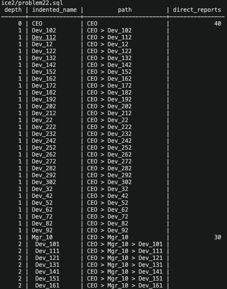

## 23번

[SQL]

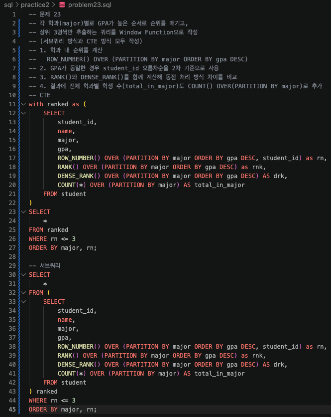

[실행결과]

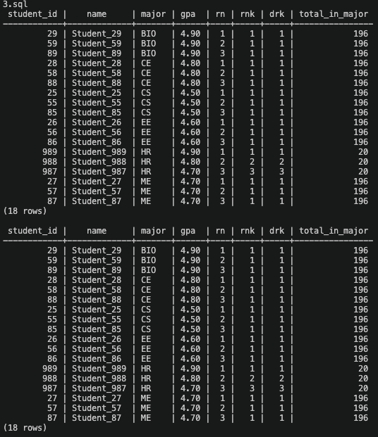

## 24번

[SQL]

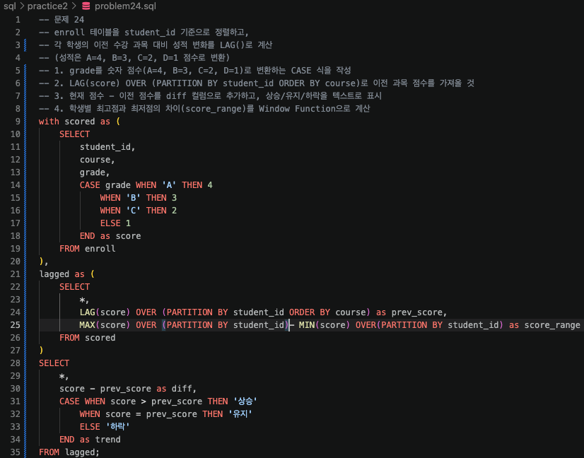

[실행결과]

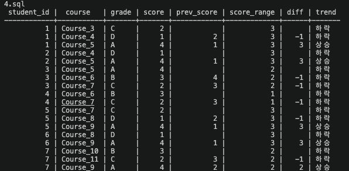

## 25번

[SQL]

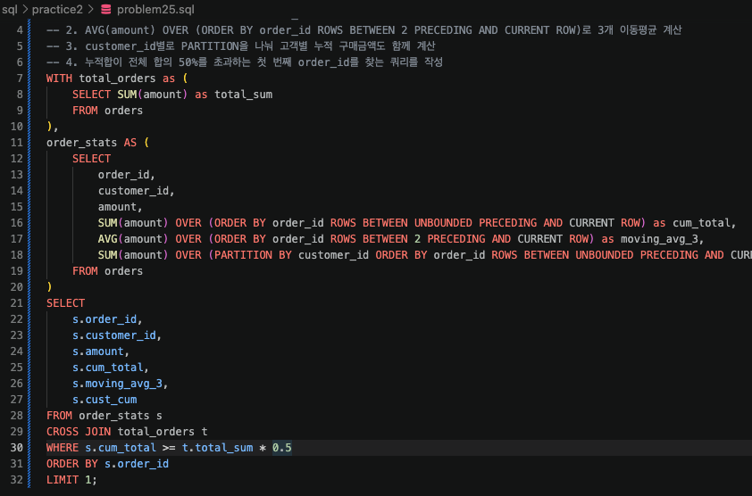

[실행결과]

